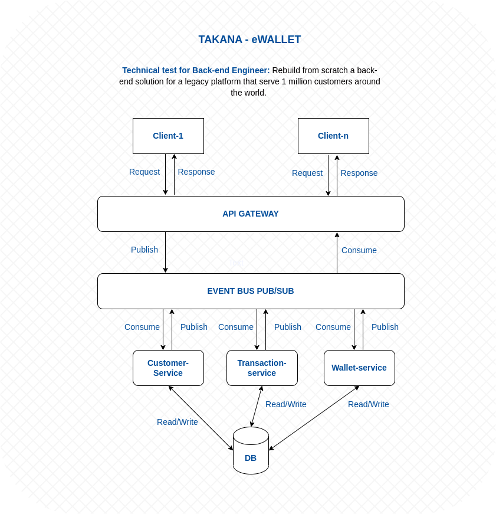
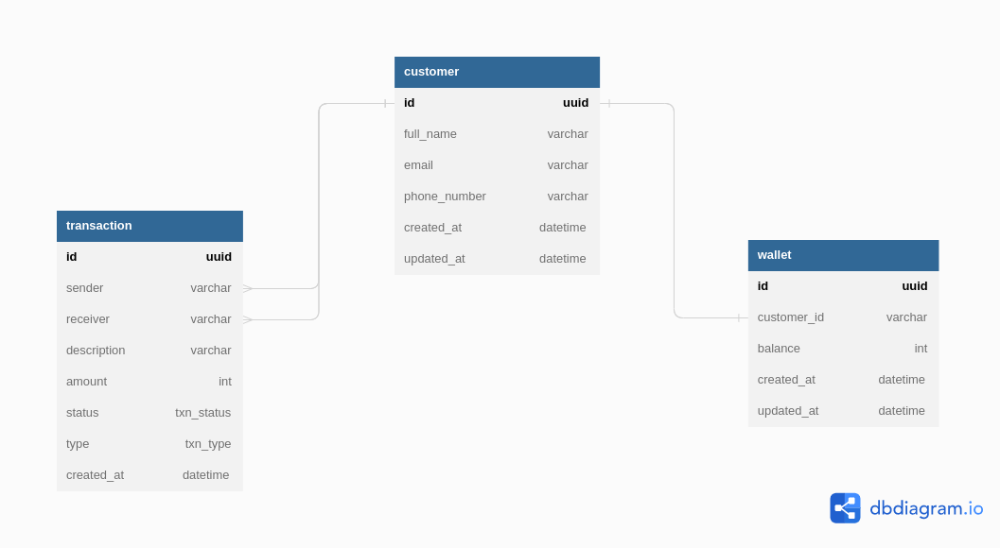

# Tekana-Ewallet
## Technical test for Back-end Engineer
Rebuild from scratch a back-end solution for a legacy platform that serve 1 million customers around the world. With this technical test we considered the lagacy system to be monolithic which made us choose a microservice architecture over monolithic one, to speed up the time to market, make it scalable, improve security, and adopt event-driven design.  
>For the sake of this project we used a version-controlled code repository that holds many projects. While these projects may be related, they are often logically independent and can be managed by different teams.

# Strategies
  -  **Before starting the rebuild, we will evaluate the existing system, prioritize what needs to be done according to user research.**  
   eg:

     * Define the current state and potential issues 
     * Taking into account business growth plans 
     * Carefully study and review the architecture, code, functionality and users' pain points when interacting with the app
     * Consider features that you would like to introduce in the future and assessing them from the technical perspective 

  - **Define measurable metrics of success, have clear objectives for the team to know what would focus on and what to leave out.**  
    eg:

     * Reduced maintenance costs
	 * Improved performance rate
	 * Increased product uptime
	 * etc

  - **Choose the right technologies and architecture to use, with this test we considered the lagacy system to be monolithic which made us choose microservice architecture over the usual one to speed up time to market, make it scalable, improve security, and adopt event-driven design.**
  - **Plan For going Live and system updates** 
	* Ensure all unit & integration test pass
	* Train staff meant to use the new modernized application 
	* Plan for regular software updates to avoid possible issues in the future

 # Tech Stack
  - **Monorepo**: Nx 
  - **Api Gateway**: NestJs 
  - **Service framework**: NestJs  
  - **Container**: Docker  
  - **Event Bus**: Kafka 
  - **Database**: Postgres

> **Api Gateway Documentation Link**: [host]:[port]/api

> eg: http://localhost:3333/api

# Features
  - [x] Customer
  - [X] Wallet
  - [ ] Transaction

# Database Diagram
  
# System Design 
  

